<h1 align="center">Hello people !!! 👋</h1>
<h3 align="center">My name is Leonel Borges I am a Full-Stack Web Developer</h3>

console.log(

"Welcome to my Profile"

)

- 🌱 I’m currently learning **TypeScript, React-Native, Mongodb**

- 💬 Ask me about **React, Postgresql, Redux, Node.js**

- 📫 How to reach me **leonel03t@gmail.com**

<h3 align="left">Languages and Tools:</h3>

 Android  Blender Bootstrap Char.jsCSS3 Express Git Heroku VercelJava JavaScript Mongodb Node.js PhotoShop Postgresql Postman React ReactNative Redux Typescript Unity 

📌My Proyects:

  
- **BarberApp**

 

 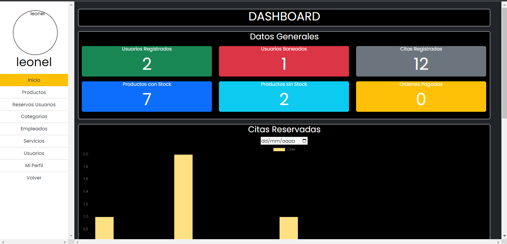

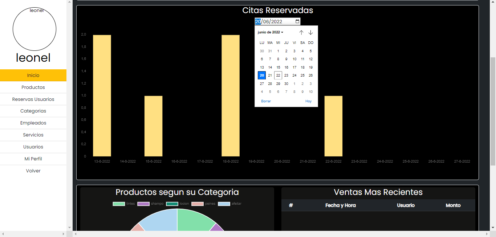 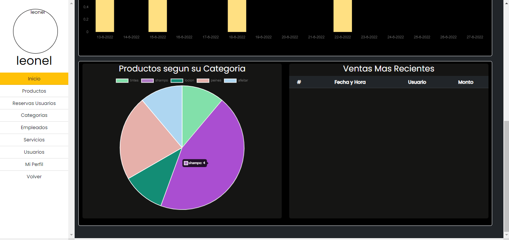

- **Contries**

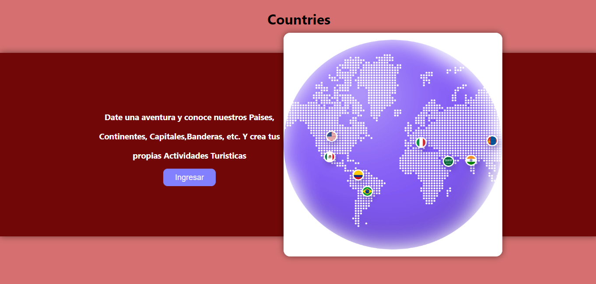 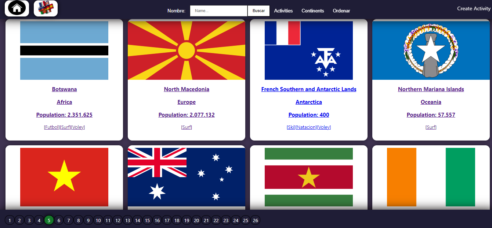

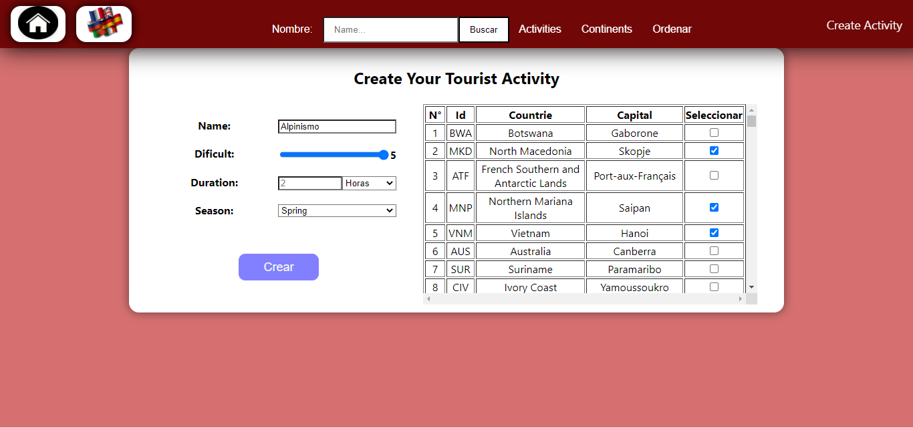 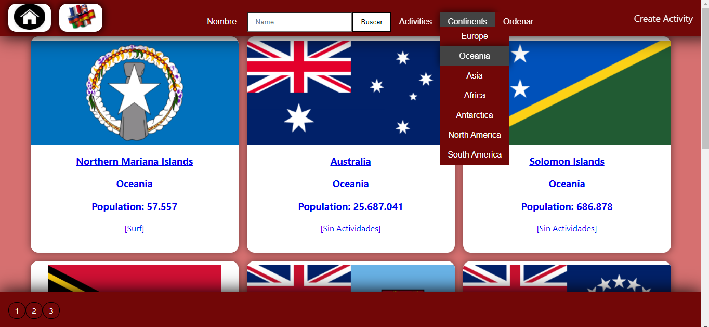

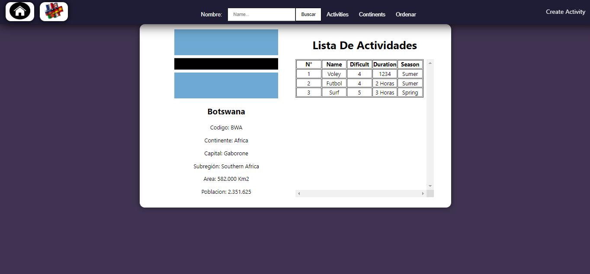 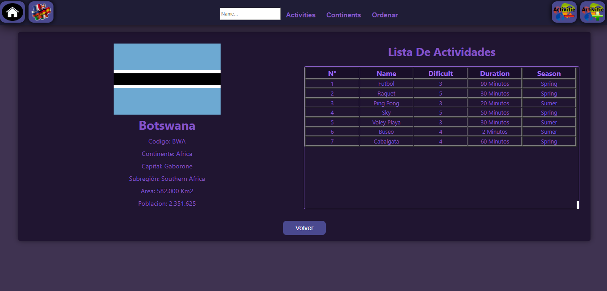

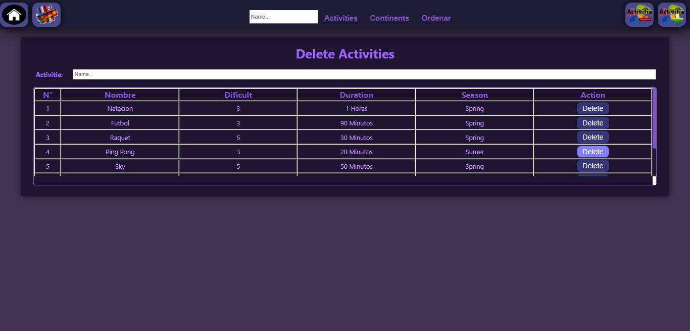 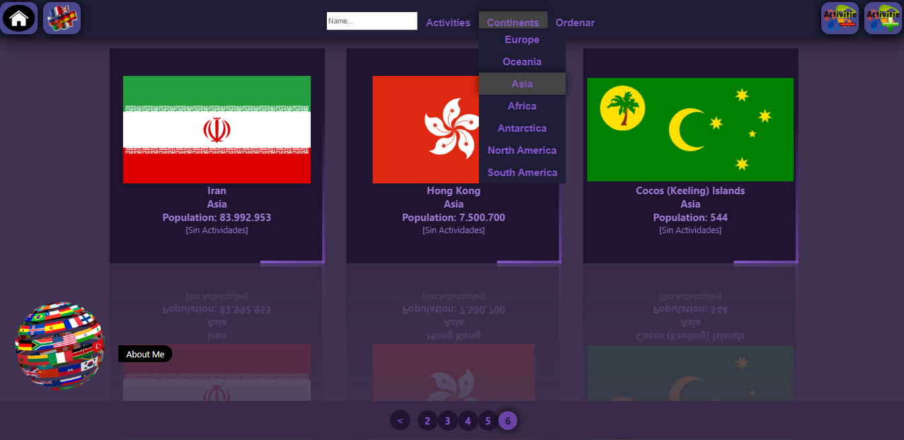

- **Breeds**

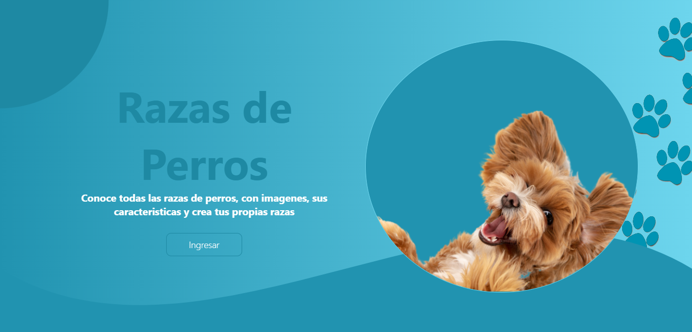 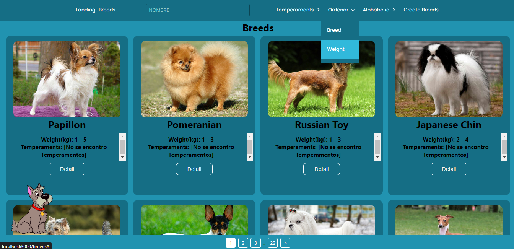

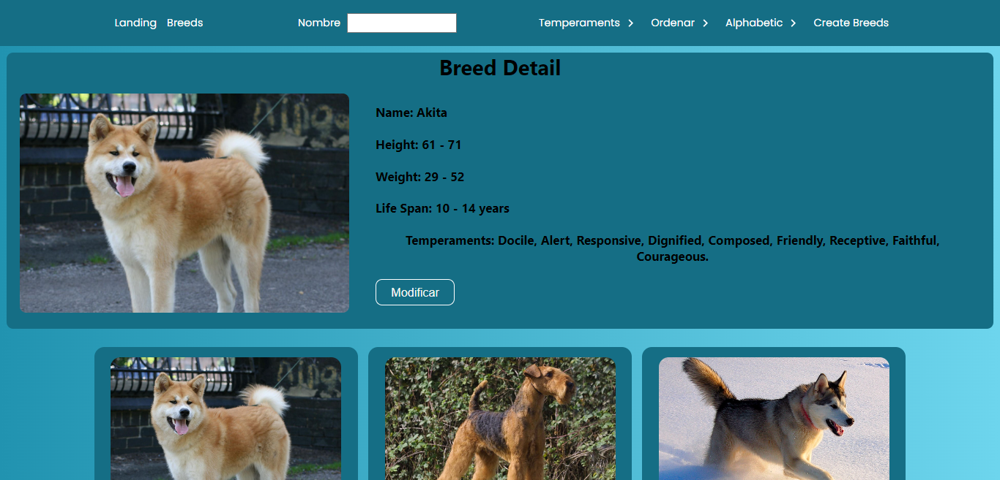 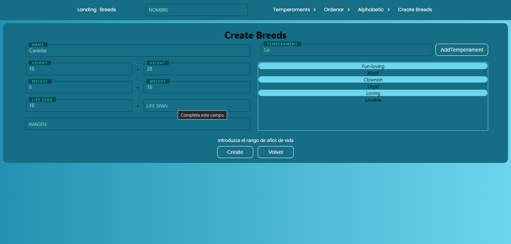

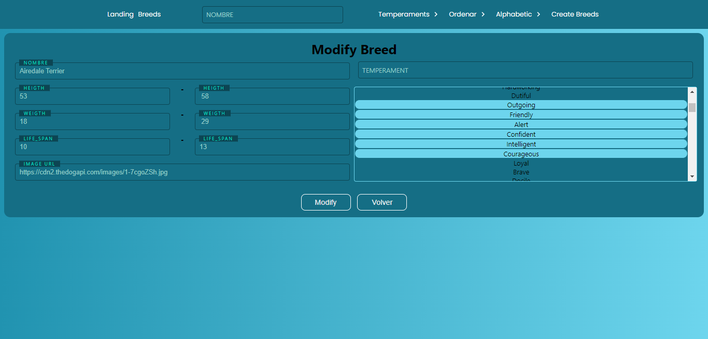 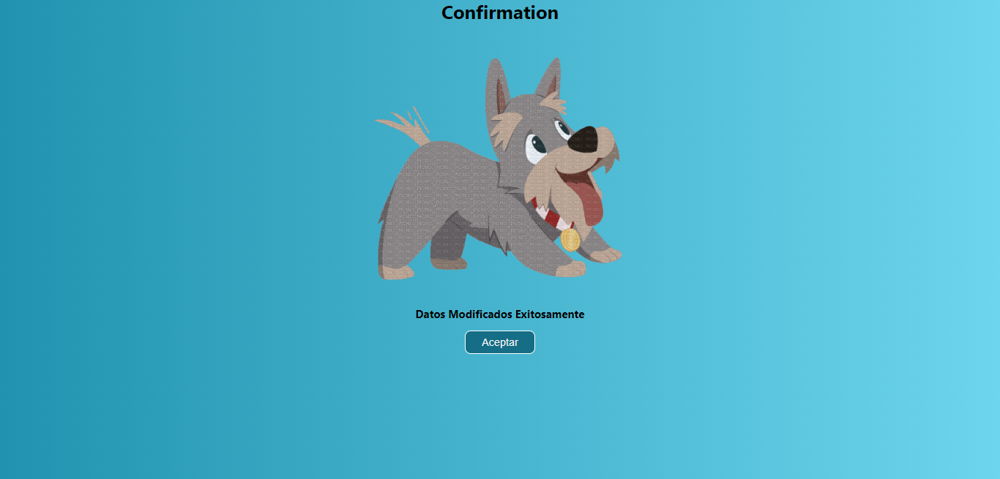

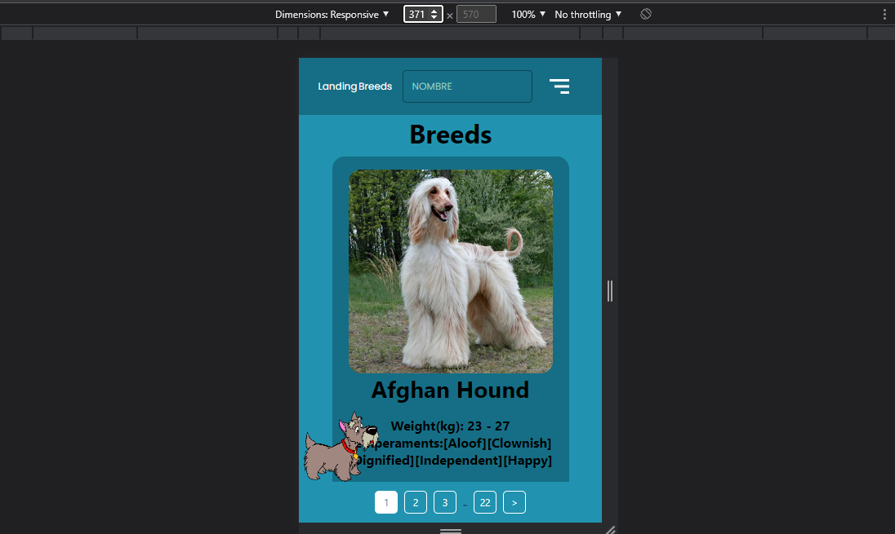 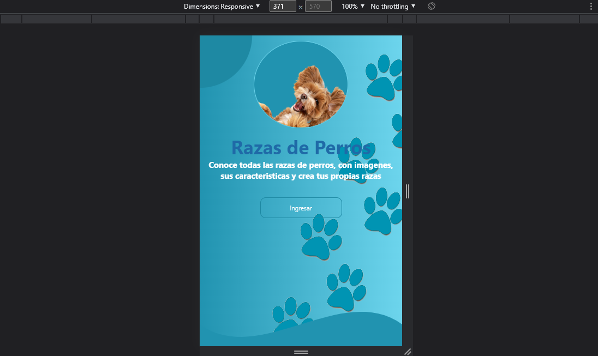

